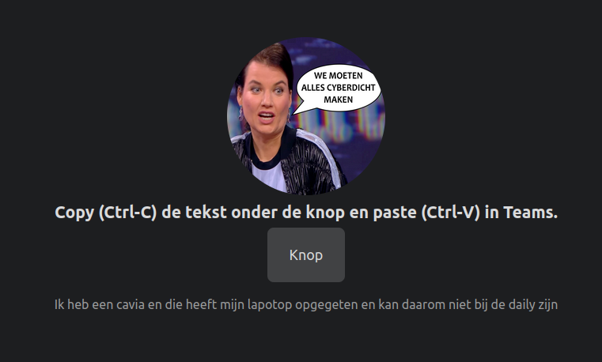

# afmelder-app
Small hacked-up site to generate excuses to skip the daily (dutch language).

## What is it?
Press the button for a random and very compelling reason to not attend the daily.

## How is it working?
The frontend is a simple Hugo site with a little bit of Javascript code in it.
The Javascript does a simple api call and put the response on the site.

The back-end consist of an actix web server behind a load balancer.
It generates a random response from a vector of strings filled with compelling reasons.
Data transfer is with advanced(tm) JSON formatting technology.
The back-end can be used standalone to integrate in other applications, it's not tied to the frontend.

## How to make it work?
Compile the digital bits and bytes in this repo and run the mess comming out of it in a Virtual Private Server (VPS).
You can enjoy all the juicy goodness of this app afterwards.
You can also run this whole hot mess on your local machine. 
Leave out the load balancer and use "localhost" as your server.

This is a manual hacked-up mess and there isn't a nice installer. To make this work, try:
* Find/have/arrange/borrow/steal a VPS, I used one with a Debian Bullseye image on it.
* Do all the SSH key, updates, firwall etc. stuff you do with a basic VPS.
* Install a webserver/load balancer (I use nginx) or use one from a Cloud something.
* git clone this repo (duh..) on your machine (laptop or desktop)
* Start a container on your machine with the `debian-podman.sh` script, or do it manually inspired by the script
    * In te container: go to the /opt/afmelder-app directory
    * Do all the Rust stuff, so maybe `cargo check` and definately `cargo build --release`
    * exit and nuke the container
* Copy (scp or rsync) the afmelder.service file in the repo to the VPS under `/etc/systemd/system/afmelder.service`
* Copy (scp or rsync) the `afmelder-app` binary from the repo `backend/target/release` directory to your VPS as /opt/afmelder-app
* Log into the VPS with SSH and do:
    * create `afmelder` user with something like `useradd -s /usr/bin/nologin -r -M afmelder`
    * Make afmelder-app executable on the VPS with something like `chmod +x /opt/afmelder-app` 
    * Start the afmelder service with `systemd start afmelder.service`
    * Check with `systemd status afmelder.service`
    * If there are errors (red text), _don't_ bother me with that. Find someone with a neckbeard to help you
    * exit SSH
* Install Hugo on your local machine using the Hugo RTFM: https://gohugo.io/installation/
* "Compile" frontend with the command `hugo` inside the repo `frontend/` directory, just like the Hugo RTFM says.
* Copy over the site found in `frontend/public/` in the `/var/www/afmelder-app/` directory on the VPS, probably with scp or rsync
* Ready! enjoy the site.

This is in no-way a comprehensive install guide, you probably need to understand Rust (well, Cargo at least) and Hugo to fix everything I didnt tell you.

## Pics or it didn't happen
Well okay, screenshots are mandatory nowadays. 

Yes, it's just a button. And a text.

Happy now? Ok let's move along.

## Contributions and Code of Conduct
For real? You _can_ submit pull requests and stuff. If you want. 
And issues, just submit any issues you have. 
There is a big chance I use my advanced /dev/null technology to this kind of stuff.

It's just a small hack, come on. No support and no nothing of course. But feel free to interact if necessary.

## Licensing and referencing
This whole thing is MIT licensed, so do the F what you want with it but don't come sueing me if anything breaks.

The front-end is based on an altered ("butchered" or "hacked-up") version of the wonderful charlolamode theme,
which is also MIT licensed, so this whole damn thing is one big MIT party licensewise.

Charlolamode theme: https://themes.gohugo.io/themes/hugo-theme-charlolamode/
